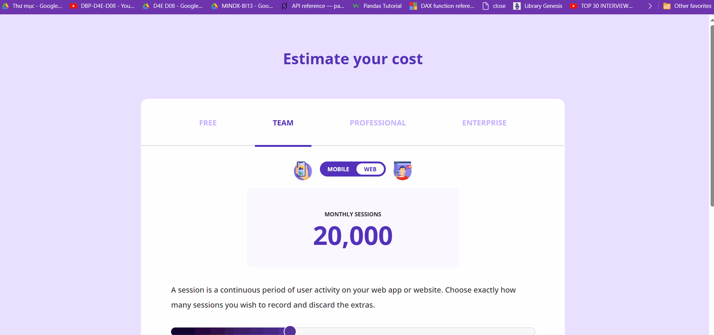

# CSS Cost Estimator Project

This project is a cost estimator web application. It allows users to estimate their cost based on different plans and usage.
It is a collection of CSS styles that can be used to create a visually appealing web page. The styles are designed to be flexible and easily adaptable to a variety of web page designs.

## Features
* Multiple plans: Free, Team, Professional, and Enterprise.
* Toggle between Mobile and Web.
* Slider to adjust the number of monthly sessions.
* Monthly and annual billing options.
* Try free for 14 days option.


## Styles Included

The CSS file includes styles for the following elements:

- `body`: Sets the background color, display properties, padding, font, and text color for the body of the webpage.
- `h1`: Styles the main headings on the page.
- `.container`: Styles a container element, which is often used to group other elements together.
- `.tabs`: Styles a tabbed interface, including the color, font weight, and spacing of the tabs.
- `.tabs p`: Styles the paragraphs within the tabs, including hover and selected states.
- `.line`: Styles a horizontal line used for visual separation.
- `.toggle-wrapper`, `.toggle`, `.toggle span:first-of-type`, `.toggle span:last-of-type`: Styles a toggle switch interface.
- `.sessions-card`: Styles a card interface used to display session information.
- `.description`: Styles a description text.
- `.slider`, `.slider .bar`, `.slider .progress`, `.slider .point`: Styles a slider interface, including the bar, progress indicator, and draggable point.
- `.scale`, `.slider .scale ul`: Styles a scale associated with the slider.
- `.card`, `.cards-wrapper`, `.card .top-section`, `.card .price`, `.card hr`, `.card button`: Styles a card interface used to display pricing information, including the wrapper for multiple cards, the top section of each card, the price text, a horizontal rule, and a button.
- `.card .save-header`: Styles a header for a card that indicates a saving.

## Usage

To use these styles, simply include the CSS file in your HTML file using the `<link>` tag in the `<head>` section of your HTML file.

```html
<link rel="stylesheet" type="text/css" href="index.css">